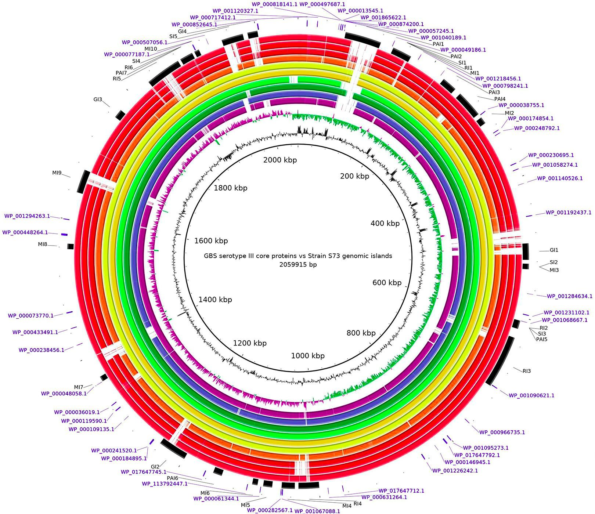

  

  (Favero <i>et al</i>., 2020)

<h2 align="center">
  Aprendizaje automático para datos genómicos: 
  Predicción de bacterias resistentes a antibióticos
</h2>

Bienvenido al taller introductorio sobre **aprendizaje automático para datos genómicos**. Conoce las fuentes de datos, los formatos de archivos y los análisis comunes en datos genómicos, y cómo conectarlos con modelos de aprendizaje automático, a través de un ejemplo relacionado a la **predicción de bacterias resistentes a antibióticos**.

### :computer: Instalación

